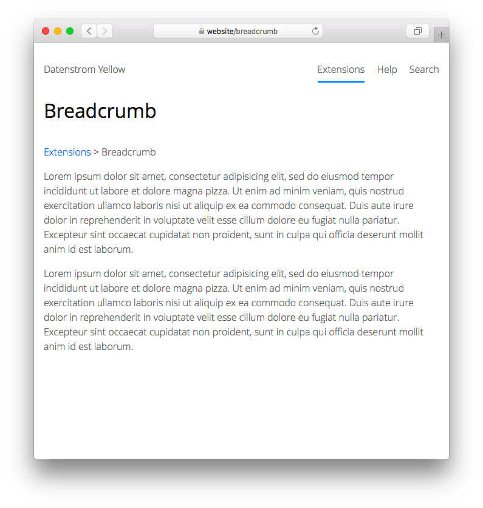

<a href="README-de.md">Deutsch</a> &nbsp; <a href="README.md">English</a> &nbsp; <a href="README-sv.md">Svenska</a>

# Breadcrumb 0.8.11

Breadcrumb navigation.

## How to install an extension

[Download ZIP file](https://github.com/annaesvensson/yellow-breadcrumb/archive/refs/heads/main.zip) and copy it into your `system/extensions` folder. [Learn more about extensions](https://github.com/annaesvensson/yellow-update).

## How to add a navigation

Create a `[breadcrumb]` shortcut. The breadcrumb navigation is automatically generated from the location.

## Examples

Content file with breadcrumb:

    ---
    Title: Example page
    ---
    [breadcrumb]
        
    Lorem ipsum dolor sit amet, consectetur adipisicing elit, sed do eiusmod tempor incididunt ut 
    labore et dolore magna pizza. Ut enim ad minim veniam, quis nostrud exercitation ullamco laboris 
    nisi ut aliquip ex ea commodo consequat. Duis aute irure dolor in reprehenderit in voluptate velit 
    esse cillum dolore eu fugiat nulla pariatur. Excepteur sint occaecat cupidatat non proident, sunt 
    in culpa qui officia deserunt mollit anim id est laborum.

Layout file with breadcrumb:

    <?php $this->yellow->layout("header") ?>
    

    

    <h1><?php echo $this->yellow->page->getHtml("titleContent") ?></h1>
    <?php echo $this->yellow->page->getExtraHtml("breadcrumb") ?>
    <?php echo $this->yellow->page->getContentHtml() ?>
    

    

    <?php $this->yellow->layout("footer") ?>

## Settings

The following settings can be configured in file `system/extensions/yellow-system.ini`:

`BreadcrumbSeparator` = text shown between elements  
`BreadcrumbPagesMin` = number of pages to show breadcrumb navigation  

## Developer

Anna Svensson. [Get help](https://datenstrom.se/yellow/help/).
